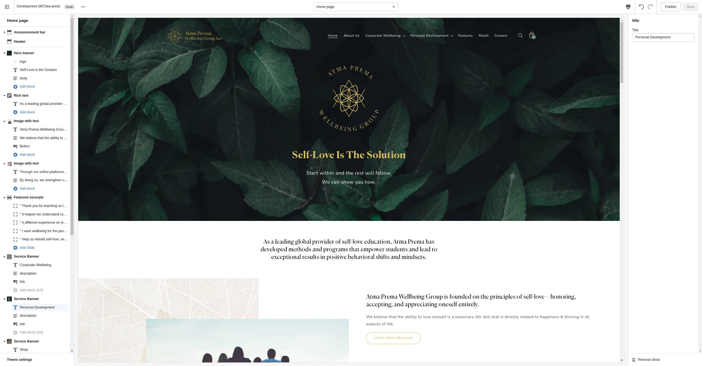

# Atma Prema Workflows

## Workflows for *writing* content

Writing content is current managed by the Shopify Content Management System and is done through Shopify's own **Content writing Engine**. 

>   `⚠` **Regarding workflow adjustments**
>
>   Sometimes workflows just aren't for you.
>   You can communicate your insights of how you work to us so we can build around your needs.
>
>   After testing and using the system for a while, you can always let us know if you need something added/streamlined as a revision

>   `⚠` **Regarding changing the look and feel of content sections**
>
>   Content can be managed displayed anywhere on the site through **content sections**, but if you ever find that the current set does not suite your needs, we are always happy to create new sections and program new behaviors for you to show off your writing! 
>
>   
>
>   Also, this can be implemented by any developer familiar with HTML, CSS, Javascript and the Liquid templating language . **However, please note that while Shopify has drag and drop customization, your site was NOT built with such and is completely custom built from a default template. As such, some behaviors were defined by us and this future developer is responsible for maintaining the integrity of our code as they make these changes. We are not liable for any unexpected behavior incurred by these modifications**

>   `⚠` **Regarding extending 'content writing' features**
>
>   Extending this system's features is possible through the use of plugins or third-party app integrations. Furthermore, you can specify your needs to an App Developer to create a service tailored to your needs. Please note, however, that in all options, you will likely be required to pay some amount for app service fees or server fees for an alternative solution as this site is considered commercial.

>   `⚠` **Regarding 'tagging' content for grouping**
>
>   Tags are delimited by `|`bar, and not by the letter `l/L` 

### Introduction

Content is managed on the Shopify `Blog posts` section of the site under the `Online Store` tab of the site.

This capability is provided free along with your Shopify subscription, allowing you to edit and create written content for your site, 
however are still able to change your **Content Management System** to something more intuitive to you at any time with the help of a **Shopify Developer**

`Blogs` are composed of articles, which can be further categorized by `Tags`

For more information, refer to [Shopify Blogs](https://help.shopify.com/en/manual/online-store/blogs)

To begin, navigate to the `Blog posts` section under the Online Store 

 

Here you will see preset filters for all the categorized groups for written content. 

**You can create, edit, delete, and set the visibility of content.**
**We've also given you a way of adding special fields related to the content**, however how these fields are displayed may sometimes necessitate code changes. Feel free to reach out to us to add these features.

How `Articles/Blog posts`  are displayed on pages relies on `Templates`, which are JSON files consisting of references to different available sections of the site and their corresponding settings. 

This `Template` determines the layout and the style of the page and several `Articles/Blog posts` may share the same `Template`

Upon opening this tab, you should see **this page**:

We've taken the liberty of creating **filters for each article category** for your convenience

**You can save your own filters** after applying inputs for your own navigation. They will be saved on the top row just like the current defaults

On clicking on the `Article/Blog post`, you will be brought to a page where you can edit article information such as...

-   `Title`: the title of the article

-   `Content`: the main content of the article
-   `Excerpt`: the text which will display on searches of the site as well as on sections such featuring previews of the articles
-   `Website CEO`: overrides the excerpt's display on searches of the site as well as the url/handle of the site
-   `Visibility`: visibility of the article
-   `Featured Image`: featured image of the article
-   `Tags`: tags of the blog ( critical for handling, grouping, searching of entries in the case of blogs `Programs`)
-   `Authour`: the author to display on the article
-   `Blog` : what blog the site belongs to 

**As an addition, ** by clicking on `More actions` you can edit the metafields of the article by clicking `Edit Metafields`.

`Metafields` add additional depth to resources on the site, including articles. 

They allow you to add custom fields not handled by default such as title and content.

 

As an example, on the `Sacred Intimacy` article, we select the `Metafield` type as `Product Reference`...

 

...and set the associated product on the page by using the `products` namespace with the `associated_product` key.

There are no pre-defined names for `Metafields` on Shopify. They are arbitrary and only matter in the context of how the code is structured to accept them. 

If you define your own metafield outside the conventions defined by us, you will still need to modify the site's template to handle it.

In this case, this `Sacred Intimacy` article can display the necessary metafield because we have designed the site as per your instruction to handle this behavior.

**However, you won't have to worry about adding new metafields unless you'd like to add/extend the functionality of your site. **

**You may just follow the conventions defined below for managing the site as it is **

### Workflows for programs

Currently, content displayed about AtmaPrema programs are handled according the specific program type ***(either personal development or corporate sessions)*** .

Following the steps for either type will allow you to set up a page with the existing template layout very quickly.

The default templates are

[template:personal-programs](#template:personal-programs:): which handles the default template of a personal program

[template:personal-programs-shop](#template:personal-programs-shop:): which handles the default template of a personal program with an associated product

[template:corporate-programs](#template:corporate-programs:): which handles the default template of a corporate program

However, certain programs pages, such as...

**Self-love Solutions** 

**Self-love Solutions for Kids** 

**Raising Frequencies**

**Corporate Programs Private Sessions**  

Have their own special templates due to special handling required during development

You can view these templates in the [Template Reference](#template-reference)

If you need to create a new template to handle some new behavior or layout that the default templates cannot currently handle, 

you can always create a new template for this.

#### I. Categorizing programs/Adding links to programs.

**`LIST` view: Lists of programs** 

Programs of the same category can be displayed through conventions in `TAGS`

These programs will be display in a `LIST` view, to the user:

 

 

Add a category to the dropdown display by doing the following...

1.    click on the `TAGS` input on the lower-right side of the article composition screen

2.   type in the tag you wish to group this program under, prefixed with `tag|new-category-for-programs`

     ​	 

3.   click "Add`tag|<new-category-for-programs>`"

4.   head to `Online Store` > `Navigation` and click on `header_menu`

      

     

 

5.   Click `Add menu item to <Personal Development/Corporate Wellbeing>`

       

6.   Now you can edit the name of this new `tag|<new-category-for-programs>` category and link directly to the `LIST` view containing the page.
     -   To link to the `LIST` page containing all articles with the same `tag|<new-category-for-programs>`, 
         -   Enter the link directly on the input and click it once it appears on the dropdown
         -   For `LIST` view for corporate wellbeing, input `/pages/corporate-wellbeing/?type=<new-category-for-programs>` 
         -   For `LIST` view for personal development, input `/pages/personal-development/?type=<new-category-for-programs>` 

**`DETAIL` view: Details of one program**

Instead of displaying multiple programs in a list, it is possible to link directly to the program's `DETAIL` view such as the image shown below:

 

To do this:

1.   Navigate to `Navigation` as above, and go to `header_menu`
2.   Click `Add menu item to <Personal Development/Corporate Wellbeing>`
3.   To link to the `DETAIL` page directly, click `Blog Posts` and select the blog from the sidebar on the right you would like this link to direct to

>   `⚠` **Linking to `DETAIL` and `LIST`**
>
>   Linking to the two types of templates mentioned above isn't exclusive to the default navigation options of the site.
>   You can also apply these same steps for any **link** setting on the Theme Editor

#### II. Adding painpoints to the programs

Painpoints for each program may affect how the program appears when searched in the `LIST` view of programs.

To add painpoints for a program, when editing or creating a new blog post

1.   Click on the `TAGS` input on the lower-right side of the article composition screen

​		 

2.   Type in the painpoint you wish to group this program under, with `painpoint|<name-of-painpoint>`, separated by `-`
      

3.   Click "Add`painpoint|<name-of-painpoint>`"

#### III. Changing the program template

Changing the program template is done by selecting the desired template on the `Theme template` dropdown

 

#### IV. Setting program capabilities

To **enable the capability to receive requests for program brochures** on the page, which is enabled by adding `capabilities|inquiry` to `Tags`

 

To **add a page button directing the user to join the telegram community**, add `capabilities|join-telegram` to `Tags`

#### V. Adding program testimonials

1.   Click on a `Blog Post/Article` to add/edit information

2.   Click on `Edit Metafields` under `More Actions`

     

3.   Add testimonials by inserting a metafield of type `Multi-line text` with the `Namespace` "testimonials"

     The key value can be any arbitrary value as long as it is unique across the namespace

     

4.   You can edit the content of the testimonial in each entry's **text area** as show below.

 

### Writing about Corporate Programs

Corporate programs using are all generally handled the same way and thus use the same template.

However within corporate programs, the **following entries all have special handling** and thus required specific templates of their own: 

-   **Corporate programs Private Sessions** , which uses `corporate-programs-private`

**To write content about corporate programs...** 

1.  Simply click `Add a Blog Post` and write your content or edit an existing one

2.  Select **Program** as the **Blog**

     

2.  Type in `session|corporate` in the `TAGS`input 

3.  Click on `session|corporate`

     

4.   Select the theme template to be `corporate-programs` for it have the form handling of a corporate program

      
     
5.   Refer to **Sections I-V in *General Workflows for program for additional settings***

5.   Set the `Visibility` to `Visible` and click `Save`

This program should now appear under **"Corporate Sessions"**

### Writing about Personal Programs

Personal programs using are all generally handled the same way and thus use the same  [personal-programs](#template:personal-programs:) template.

However within personal programs, the **following entries all have special handling** and thus required specific templates of their own: 

-   **Self-love Solutions** , which uses [self-love](#template:self-love:) 
-   **Self-love Solutions for Kids**, which uses [self-love-kids](#template:self-love-kids:) 
-   **Raising Frequencies** which uses [raising-frequencies](#template:raising-frequencies:) 

**Furthermore, some personal programs such as workshops and retreats** feature an associated `Product` entity. 

These types of programs use the template [personal-programs-shop](#template:personal-programs-shop:) 

**To write content about personal programs (not associated to any product)** ... 

1.  Simply click `Add a Blog Post` and write your content or edit an existing one

2.  Select **Program** as the **Blog**

     

2.  Type in `session|personal` in the `TAGS`input 

3.  Click on `session|personal`

     

4.   Select the theme template to be `personal-programs` for it have the form handling of a personal program 

 

5.   Refer to **Sections I-V in *General Workflows for program* for additional settings**
5.   Set the `Visibility` to `Visible` and click `Save`

This program should now appear under **"Personal Programs"**

**To write content about personal programs (associated to some product)**

1.  Simply click `Add a Blog Post` and write your content or edit an existing one 

2.  Select **Program** as the **Blog**

     

2.  Type in `session|personal` in the `TAGS`input (as above)

3.  Click on `session|personal`

     

4.   Select the theme template to be `personal-programs-shop` for it have the form handling of a personal program 

 

5.   To add the associated product, click on `More Actions > Edit Metafields`...

      

     -   Add the metafield `associated_product` defined in the [template reference](#template:personal-programs-shop:) 

     -   Select the product to associate to this `Article`

         

6.   Refer to  **Sections I-V in *General Workflows for program* for additional settings**

6.   Set the `Visibility` to `Visible` and click `Save`

This program should now appear under **"Personal Programs"**

### Writing about "Our Team"

Content for writing teachers is displayed under the blog `Our Team`

To add content to display under `Our Team` simply select the blog corresponding to `Our Team` after writing the article

1.  Simply click `Add a Blog Post` and write your content or edit an existing one

2.  Select the `Blog` to be `Our Team`
    

    

3.  Select the `Theme template` to be `people`

     

4.  Set the `Visibility` to `Visible` and click `Save`

    

### Writing about "Self-love Teachers"

Content for writing teachers is displayed under the blog `Self-Love Teachers`

To add content to display under `Self-Love Teachers` simply select the blog corresponding to `Self-Love Teachers`after writing the article

1.  Simply click `Add a Blog Post` and write your content or edit an existing one
2.  Select the `Blog` to be `Self-Love Teachers`
     
3.  Select the `Theme template` to be `people`

 

4.   Set the `Visibility` to `Visible` and click `Save`

### Writing about "Features"

Content for writing teachers is displayed under the blog `Features`

Articles under `Features` are handled a bit differently from other written content, 

in that **they require a link to external content in content in place of regular article content:** 

 

1.  Simply click `Add a Blog Post` and write your content or edit an existing one

2.  Set the `Title` of the article to mirror the article of the external resource

    

3.  Set the `Content` of the article to be the link to the corresponding external resource. 

    **DO NOT** add any other information to this input

     

4.  Select the `Blog` to be `Atma Prema Features`
    

5.  Add an arbitrary excerpt for the feature. 

    This will be the short-form text featured on your website

    In this example, we placed the media site title in **bold titles** and the excerpt

     

6.  Add an image to the featured article

     
    
7.  Set the `Visibility` to `Visible` and click `Save`

    
    
    This program should now appear under **"Atma Prema Features"**
    
    

## Workflows for *displaying* written content

As mentioned in the previous sections, content can be managed displayed anywhere on the site through `Sections`.

`Sections` are what make up the various pages of your site, and their use and configuration are stored in a `Template` file.

While the site is built by modifying markup and styles through HTML, CSS and JS, 
some basic customization is possible through the use of the **Theme Editor**

**Before proceeding, we recommend going through a quick overview of Shopify's documentation on how to [edit themes](https://help.shopify.com/en/manual/online-store/themes/customizing-themes/edit)**

### Editing the site 

To edit the content sections of your site, simply navigate to the **Themes** tab of your Online Store:

1.   Click the **customize** button on the currently live site 

 

2.   Navigate to the page whose sections you wish to edit

3.   You should see the `Theme Editor` open up which will allow you to edit/add sections for each page
     

     

The upper section shown here allows you to navigate between pages of the site in order to select one for customization (**PAGE**)

By default, it has the **Home Page** selected

The sidebar on the right shows the **section** for each page along with their contents, with some sections consisting of **blocks**

 

 

Clicking on a section from the right sidebar allows us to edit/remove it...

 

... through a sidebar appearing on the left:

 

Certain sections also have blocks which you can add/remove/edit

 

### Editing the site's settings

By clicking on ***Theme Settings*** on the right-hand sidebar of the Theme Editor, you can edit more general non-page specific settings of the site

 

 

For the following workflows, make sure you are already on the **Theme Editor** of the page you wish to customize

With the release of the site at the time of writing, these include...

-   displaying **Self love solutions** teachers on the **Self love solutions** page
-   displaying **Self love solutions kids** teachers on the **Self love solutions kids** page
-   display **Our Team** members on the **About Us** page
-   display **Events** on the **Home** page
-   display **Testimonials** on the home page
-   display **frequently** asked questions

### Displaying Self Love Solutions teachers *(Self Love Solutions Program Page)*

The steps in this workflow are a template for working on any section using the [Featured Articles](#section-featured-articles) section.

Please refer to this workflow for any modification or addition done on any similar section.

 

1.   Navigate to the **Self Love Solutions** page **while in the Theme Editor**

2.   Look for a section called **Featured Articles** on the bottom right

      

3.   Click `Add Article` to add a new entry to the list as a **Block**

     **OR** click on an existing **Block** and click `Remove Block` in order to remove an existing entry

4.   To reorder, entries, simply drag the block using by holding and dragging its right-hand side

      

5.   Click `Save`

### Displaying Self Love Solutions for Kids teachers *(Self Love Solutions Kids Program Page)*

1.   Navigate to the **Self Love Solutions Kids** page **while in the Theme Editor**
2.   Follow steps **2-4** as indicated above in [Displaying Self Love Solutions teachers *(Self Love Solutions Program Page)*](#displaying-self-love-solutions-teachers-self-love-solutions-program-page)

### Displaying Our Team *(About Us Page)*

1.   Navigate to the **About Us** page **while in the Theme Editor**
2.   Follow steps **2-4** as indicated above in [Displaying Self Love Solutions teachers *(Self Love Solutions Program Page)*](#displaying-self-love-solutions-teachers-self-love-solutions-program-page)

### Displaying Events *(Home Page)*

For articles, you'll primarily be concerned with using the section `Featured articles`, 

which will allow you to create a carousel of different written content that you've previously created.

 

​	

1.  If you're not already editing a page with `Section: Featured articles`, simply add it 

     

2.  You can click `Add Article` to reference an article you've written

     

3.  Click `Select Article` to open a dropdown where you can search and choose an article to feature on the carousel

    Click `Article content links to ext` if the article's content links to an external resource 

    

    ​	 

     

4.  Adjust the section settings according to your needs

     

5.  Click `Save`

### Writing questions/answers

1.   If you're not already editing a page with `Section: FAQ Contact Dropdowns`, simply add it

2.   Click `Add Question`

3.   Add the question/answer in the sidebar

      

4.   Edit the `FAQ Heading` and `FAQ Subtitle` of the featured excerpts

      

5.   Click `Save` and the changes should now reflect

      

     

### Writing excerpts/testimonials not associated to any particular program

1.   If you're not already editing a page with `Section: Featured excerpts`, simply add it

2.   Click `Add: Slide` in order to add an excerpts

3.   Add some slide text representing excerpts/testimonials

      

4.   Edit the title and subtitle of the featured excerpts

      
     
5.   Click `Save` and the changes should now reflect

     

### Adding icons to `Section: Featured excerpts`

Icons are handled through referencing svg's in the file `snippets/icon-partners.liquid`

1.   Click `Edit code`

      

2.   Navigate to `icon-partners.liquid` under `snippets`

      

     and you should see this file with a `case...when` tag

     

3.   Right below ``, type the name of your icon enclosed in ``

      

4.   Copy and paste the `<svg>` markup under the `` tag

     Please note that the `svg` needs to be a **Vector images** and not a **Raster image**

     To understand the difference, refer to [Adding vector graphics to the Web](https://developer.mozilla.org/en-US/docs/Learn/HTML/Multimedia_and_embedding/Adding_vector_graphics_to_the_Web)

      

5.   Click `Save` and the changes should now reflect

6.   Go back to the **Theme Editor** and add a comma-separated entry to the `Featured-logos` setting of `Section: Featured excerpts`

     

## Workflows for Retail

### Retail page

The Retail page displays featured collections with the use of the [Collection list](#section-collection-list) section

In order to add/remove collections to this section,

Click **Add Collection ** on the **Collection list** section to reference a collection:

 

Click on the **Block** of the featured collection you wish to remove  

Click **Remove Block ** on the **Collection list** section to remove a featured collection:

 

# Reference

## Templates Reference

>   *Templates control what's rendered on each type of page in a theme.*
>
>   *Each page type in an online store has an associated template type. You can use the template to add functionality that makes sense for the page type. For example, you can add additional product recommendations to a product template, or add a comment form to an article template.*
>
>   *You can create [multiple versions of the same template type](https://shopify.dev/themes/architecture/templates#alternate-templates) to create custom templates for different use cases. For example, you can create a separate product template for outerwear products, or a separate page template for pages with video content.*
>
>   
>
>   ~ From Shopify Documentation on [Templates](https://shopify.dev/themes/architecture/templates)

###	template:personal-programs:

​	default template for personal programs

**Metafields:**

`testimonial (accepts multiple)`

​	`type: (Multi-line text), namespace: testimonials, key: <name-of-the-testimonial>`

​	 The associated testimonial of this particular program

​	 Each individual testimonial can have an arbitrary unique key. The only requirement is that they share the namespace: `testimonials`

 

### template:personal-programs-shop:

​	template for personal programs meant to be associated with a product **such as workshops or retreats**

**Differences with the default template:**

This template a displays a ***Call to Action*** for an associated product instead of a program booking form

**Metafields:**

`associated_product`

​	`type: (Product Reference), namespace: products, key: associated_product`

​	the associated product of this particular program

   

### template:raising-frequencies:  

​	unique template for the raising frequencies program

  	

### template:self-love:  

​	unique template for the self-love-solutions program

**Differences with the default template:**

This template features the self-love-solutions video and the specific teachers for the program 

 

### template:self-love-kids:  

​	unique template for the self-love-solutions for kids program

**Differences with the default template:**

This template features the specific teacher for the program 

 

### template:corporate-programs 

​	default template for corporate programs

**Metafields:**

`testimonial (accepts multiple)`

​	`type: (Multi-line text), namespace: testimonials, key: <name-of-the-testimonial>`

​	The associated testimonial of this particular program

​	Each individual testimonial can have an arbitrary unique key. The only requirement is that they share the namespace: `testimonials`

 

### template:corporate-programs-private:

​	unique corporate program template which features cross-promotion of **Enlightened Leadership** and the **Self love Solutions**

 

## Sections Reference

>   Themes use *sections* to create your ideal layout. Most sections are made up of *blocks* that serve a specific function, such as headers, text, single images, a collage of images, or links. Using sections and blocks in your templates provides more flexibility in how you arrange your store's content, enabling you to control the look and feel of your online store without the need to edit code.
>
>   Each section has a specific variety of blocks that you can add to it. Which sections and blocks are available depends on your theme. For more information about what options are available to you, refer to your theme documentation.
>
>   Some sections have limits on the number of blocks that you can add, or limits on the number of blocks of a certain type. For example, the *Image with text* section can only display the blocks specified by the theme designer for your theme. In *Dawn*, the free Shopify theme, you can add only one of each of the following blocks:
>
>   -   a heading
>   -   a paragraph
>   -   a button
>
>   You can further customize the section by editing its *Settings* to include an image and choose the alignment, size, background color, and what loads first when customers visit your online store.
>
>   If the sections that you add to your store layout don't include the settings or options that you need, then you can [edit your theme code](https://help.shopify.com/en/manual/online-store/themes/theme-structure/extend/edit-theme-code#edit-your-theme-code) or [contact your theme's developer for support](https://help.shopify.com/en/manual/online-store/themes/theme-support#where-to-find-support-for-your-theme).
>
>   
>
>   ~ Shopify documentation on [sections](https://help.shopify.com/en/manual/online-store/themes/theme-structure/sections-and-blocks)

### Generic sections

#### section: Featured articles

A section for featuring various written content managed through Shopify's **Blogs** through adding **Blog posts** as **Blocks**.

#### section: Featured excerpts

A section for featuring multiple short-form written word such as excerpts, testimonials, and quotes as a carousel, with each entry represented as a slide on the aforementioned carousel.

Content for this section is managed directly through `Blocks` and not through Shopify's own **Content writing Engine**

#### section: Rich text

A simple section for arbitary text and an interactive element

**Blocks**

-   Text: arbitrary short-form text
-   Button: a link to direct the user to some resource, external or on-site.

#### section: Image with text

A section for a column of images container and text.

This section allows you to change the order and positioning of image and text

#### section: Hero banner

A section meant to be arranged at the topmost position of the template.

This section accepts both still and moving background images

**Blocks**

-   Logo: logo to display
-   Title: heading text which allows for arbitrary input
-   Body: content text which allows for  arbitrary input
-   Blog Title: block to reference blog title (only applies for blog templates)
-   Collection Title: block to reference collection title  (only applies for collection templates)
-   Page Title (only applies for page templates)
-   Article title (only applies for article templates)

#### section: Service banner

A form of CTA linking to a certain page

**Blocks**

-   Title: heading text which allows for arbitrary input
-   Description: content text which allows for  arbitrary input
-   Link: button label and link

#### section: Collection list

The `Collection list` section allows for featuring a list of active collections on the site.

You can edit the... 

-   **sizes of the image** 
-   **colors of the blocks** 
-   **responsive behavior** 

of the section.

The featured **collections** are featured as blocks.

 

#### section: Product grid

The `Product grid` section allows for featuring a list of active products on the site.

You can edit the... 

-   **filtering/sorting behavior** using settings under `FILTERING AND SORTING`
-   **pagination behavior** using settings under the `Products per page`
-   **image sizes and behavior**

of the section.

The featured **products** depend on the **collection** the page is currently on.

 

### Specific sections

The below sections are designed to be used specifically on certain pages or for certain pages

#### section: About Intro (About page)

This section was designed specifically to feature company information.

You can add/edit a **caption, title, and description for this section.**

You can also edit the two pictures displayed below.

 

#### section: Featured services (Corporate, Personal Programs)

This section displays a list of services. 

Currently, this section is being used on the `Corporate Wellbeing` and `Personal Development` pages and is designed handling for filtering programs to the specific type.

You can set the order of programs displayed for this section using the `Order of Services`, using a new-line separated list of program handles.

 

#### section: Footer cta (Footer)

This section displays common cta's across all of your site's pages on the footer

You can add display **up to three** blocks which are **forms** or **call-to-action's**

For **forms**, you can specify the email's `setting: Email Reason` and `setting: Email Response type` which is relevant in the content of the email sent to the **AtmaPrema** email and the corresponding ***automated response*** 

Additionally, use the `setting: Also links to` setting to set a page to open alongside the form submission.

For **call-to-action's**, you can specify the button label and button link using `setting: Button label` and `setting: Button Link`

 

#### section: CTA form (Footer)

This section is to display a single cta across all of your site's pages on the footer

 

#### section: FAQ Contact Dropdowns

A section of dropdowns headed with a question and reveals the answer corresponding to the question

 

